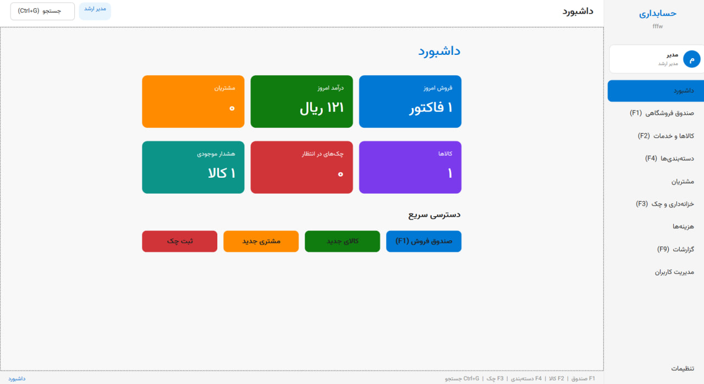
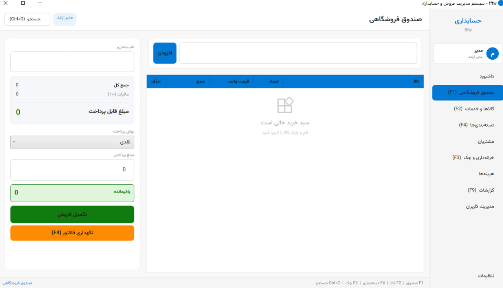

# سیستم مدیریت فروش و حسابداری چندکسب‌وکاره

نرم‌افزار جامع مدیریت فروش، انبار، حسابداری و مشتریان برای کسب‌وکارهای ایرانی


---

## معرفی

نرم‌افزار حرفه‌ای مدیریت فروشگاه و حسابداری برای کسب‌وکارهای ایرانی ساخته شده با `C#` و `.NET 9` و `WPF`. این سیستم با هدف ارائه راهکاری جامع و یکپارچه برای فروشگاه‌ها، بنگاه‌ها و نمایشگاه‌های ایرانی طراحی شده است. پشتیبانی کامل از زبان فارسی با فونت `Vazirmatn`، تقویم جلالی، محاسبه مالیات ارزش افزوده و گرد کردن ریالی از ویژگی‌های اصلی این نرم‌افزار است.

سیستم به صورت `Offline-First` با پایگاه داده `SQLite` کار می‌کند و نیازی به اتصال اینترنت ندارد. معماری `MVVM` با استفاده از `CommunityToolkit.Mvvm` تضمین می‌کند که کد تمیز، قابل نگهداری و قابل گسترش باشد. این نرم‌افزار برای فروشگاه‌های کوچک تا متوسط طراحی شده و امکان گسترش برای کسب‌وکارهای بزرگتر را دارد.

از جمله امکانات کلیدی می‌توان به صندوق فروشگاهی هوشمند با جستجوی محصول، مدیریت کالاها و دسته‌بندی‌ها، سیستم خزانه‌داری و چک، گزارش‌گیری پیشرفته با خروجی PDF و Excel، و سیستم مدیریت کاربران با نقش‌های مختلف اشاره کرد. تمام بخش‌های برنامه از صفحه‌بندی جداول، فیلتر لحظه‌ای، جستجوی سراسری و خروجی چاپ پشتیبانی می‌کنند.

این پروژه با بیش از ۵۰ فایل کد و ۵۰۰۰+ خط کد، یک نرم‌افزار کامل و آماده استفاده تجاری است. سیستم نصب‌کننده حرفه‌ای با Inno Setup و قابلیت انتشار به صورت فایل اجرایی مستقل نیز فراهم شده است.

## ساختار پروژه

```
PosAccountingApp/
├── App.xaml                          نقطه ورود برنامه + منابع سراسری
├── App.xaml.cs                       منطق راه‌اندازی و AppSettings
├── PosAccountingApp.csproj           تنظیمات پروژه و بسته‌ها
├── AssemblyInfo.cs                   اطلاعات مونتاژ
│
├── Controls/                         کنترلهای قابل استفاده مجدد
│   ├── PaginatedDataGrid.xaml        جدول با صفحه‌بندی/خروجی/چاپ
│   ├── PaginatedDataGrid.xaml.cs     منطق صفحه‌بندی و خروجی
│   ├── DetailWindow.xaml             پنجره جزئیات ردیف
│   └── DetailWindow.xaml.cs          نمایش فیلدها به صورت کارت
│
├── Converters/                       مبدلهای XAML
│   └── BoolToVisibilityConverter.cs  تبدیل Bool به Visibility، رقم فارسی، تاریخ جلالی، ایلوم به فارسی
│
├── Data/                             لایه دسترسی به داده
│   ├── AppDbContext.cs               کانتکست EF Core + پیکربندی ۱۶ جدول + فیلتر حذف نرم
│   ├── DatabaseInitializer.cs        ایجاد خودکار دیتابیس + مسیر ذخیره
│   ├── ExportHelper.cs               خروجی PDF (iTextSharp) + Excel (OpenXml) + چاپ
│   └── ThemeManager.cs              تغییر پویای تم روشن/تاریک
│
├── Models/                           مدل‌های داده
│   ├── Enums.cs                      ۱۶ ایلوم (نقش، واحد، نوع پرداخت، وضعیت و...)
│   ├── User.cs                       BaseEntity + User + Warehouse + Product + Customer + Sale + Cheque + Expense + ۸ مدل دیگر
│   └── Category.cs                   ProductCategory با زیرمجموعه
│
├── Resources/                        منابع بصری
│   ├── Themes.xaml                   تعریف رنگ‌های تم روشن و تاریک
│   └── Styles.xaml                   استایل‌های سراسری (دکمه، متن، جدول، سایدبار و...)
│
├── ViewModels/                       ویومدل‌ها (MVVM)
│   ├── MainViewModel.cs              مدیریت ناوبری و تم
│   ├── DashboardViewModel.cs         آمار داشبورد
│   ├── PosViewModel.cs               صندوق فروشگاهی + جستجوی محصول
│   ├── ProductsViewModel.cs          مدیریت کالاها + دسته‌بندی
│   ├── CustomersViewModel.cs         مدیریت مشتریان
│   ├── ChequesViewModel.cs           مدیریت چک‌ها
│   ├── ExpensesViewModel.cs          مدیریت هزینه‌ها
│   ├── ReportsViewModel.cs           گزارشات
│   ├── SettingsViewModel.cs          تنظیمات + تم + فونت + کنتراست
│   ├── UsersViewModel.cs             مدیریت کاربران
│   ├── CategoriesViewModel.cs        مدیریت دسته‌بندی‌ها با زیرمجموعه
│   └── GlobalSearchViewModel.cs      جستجوی سراسری
│
├── Views/                            نماهای XAML (رابط کاربری)
│   ├── MainWindow.xaml               پنجره اصلی + سایدبار
│   ├── MainWindow.xaml.cs
│   ├── SetupWindow.xaml              پنجره راه‌اندازی اولیه
│   ├── SetupWindow.xaml.cs
│   ├── LoginWindow.xaml              پنجره ورود
│   ├── LoginWindow.xaml.cs
│   ├── DashboardView.xaml            داشبورد با کارت‌های رنگی
│   ├── DashboardView.xaml.cs
│   ├── PosView.xaml                  صندوق فروشگاهی با جستجو
│   ├── PosView.xaml.cs
│   ├── ProductsView.xaml             مدیریت کالاها
│   ├── ProductsView.xaml.cs
│   ├── CategoriesView.xaml           مدیریت دسته‌بندی‌ها
│   ├── CategoriesView.xaml.cs
│   ├── CustomersView.xaml            مدیریت مشتریان
│   ├── CustomersView.xaml.cs
│   ├── ChequesView.xaml              خزانه‌داری و چک
│   ├── ChequesView.xaml.cs
│   ├── ExpensesView.xaml             ثبت هزینه‌ها
│   ├── ExpensesView.xaml.cs
│   ├── ReportsView.xaml              گزارشات
│   ├── ReportsView.xaml.cs
│   ├── SettingsView.xaml             تنظیمات + تم + فونت + کنتراست
│   ├── SettingsView.xaml.cs
│   ├── UsersView.xaml                مدیریت کاربران
│   ├── UsersView.xaml.cs
│   ├── GlobalSearchWindow.xaml       پنجره جستجوی سراسری
│   ├── GlobalSearchWindow.xaml.cs
│   ├── HelpWindow.xaml               راهنمای برنامه
│   └── HelpWindow.xaml.cs
│
├── Migrations/                       مایگریشن‌های EF Core
│   ├── 20260614114553_InitialCreate.cs
│   ├── 20260614114553_InitialCreate.Designer.cs
│   └── AppDbContextModelSnapshot.cs
│
├── .gitignore                        فایل‌های نادیده‌گرفته‌شده گیت
├── readme.md                         راهنمای پروژه (فارسی)
├── setup.md                          راهنمای نصب (فارسی)
├── technical.md                      مستندات فنی (فارسی)
├── thisapp2.txt                      لیست کامل امکانات (فارسی)
├── installer.iss                     اسکریپت Inno Setup برای نصب‌کننده
├── publish.bat                       اسکریپت ساخت نسخه اجرایی
├── license.txt                       مجوز نرم‌افزار
└── readme_install.txt                راهنمای نصب (فارسی)
```
## تصاویر برنامه 




## امکانات

### ورود و امنیت
- راه‌اندازی اولیه با اطلاعات فروشگاه
- ورود چندکاربره با کد عبور رمزنگاری‌شده (SHA-256)
- نقش‌ها: مدیر ارشد، مدیر، صندوقدار، مشاور، حسابدار
- افزودن/حذف کاربر توسط مدیر

### صندوق فروشگاهی
- جستجوی محصول با نام یا بارکد در لیست کشویی
- محاسبه خودکار مالیات (۱۰٪)
- روش‌های پرداخت فارسی: نقدی، کارتخوان، نسیه، اقساطی
- نگهداری فاکتورهای معلق

### مدیریت کالاها
- ثبت بارکد، عنوان، قیمت، موجودی
- واحدها به فارسی: عدد، کیلوگرم، جعبه، متر، تن، کیسه
- انتخاب دسته‌بندی از لیست کشویی
- هشدار موجودی کم

### دسته‌بندی کالاها
- زیرمجموعه (ساب‌کتگوری)
- ۲۰ آیکون آماده
- ترتیب نمایش

### مشتریان
- دفتر معین، سقف اعتبار، امتیاز وفاداری

### خزانه‌داری
- ثبت چک‌های دریافتی/پرداختی با وضعیت

### هزینه‌ها
- دسته‌بندی و گزارش‌گیری

### حسابداری
- دفتر کل با حساب‌های گروه (دارایی، بدهی، سرمایه، درآمد، هزینه)
- ثبت اسناد حسابداری با بدهکار/بستانکار
- بررسی تراز اسناد

### مدیریت بدهی تامین‌کنندگان
- ثبت تامین‌کنندگان با اطلاعات تماس
- ثبت خرید و افزایش بدهی
- ثبت پرداخت و کاهش بدهی
- ثبت مرجوعی کالا
- دفتر تاریخچه هر تامین‌کننده
- نمایش کل بدهی تامین‌کنندگان

### خروجی و چاپ
- خروجی PDF با فونت فارسی
- خروجی Excel (.xlsx)
- چاپ مستقیم A4 افقی
- صفحه‌بندی: ۵/۱۰/۲۰/۵۰/همه ردیف

### جستجو
- جستجوی سراسری (Ctrl+G)
- فیلتر لحظه‌ای در هر صفحه

### جزئیات
- دوبار کلیک روی ردیف برای نمایش جزئیات

### تم و ظاهر
- تم روشن و تاریک
- اندازه فونت قابل تنظیم (۱۰ تا ۲۰)
- کنتراست بالا برای دسترسی‌پذیری
- رابط ۱۰۰٪ فارسی با فونت Vazirmatn
- پنجره‌های واکنشی (Responsive)

## راهنمای سریع

```bash
winget install Microsoft.DotNet.SDK.9
cd PosAccountingApp
dotnet run
```

## کلیدهای میانبر

| کلید | عملکرد |
|------|--------|
| Ctrl+G | جستجوی سراسری |
| F1 | صندوق فروشگاهی |
| F2 | کالاها و خدمات |
| F3 | خزانه‌داری و چک |
| F4 | دسته‌بندی‌ها |
| F9 | گزارشات |

## فناوری‌ها

- .NET 9 / WPF / MVVM
- EF Core 9 / SQLite
- iTextSharp (PDF) / DocumentFormat.OpenXml (Excel)
- فونت Vazirmatn / Segoe MDL2 Assets
- تم روشن/تاریک / کنتراست بالا

## ریست برنامه

```
%LOCALAPPDATA%\PosAccountingApp\pos_data.db
%LOCALAPPDATA%\PosAccountingApp\settings.json
```

> نسخه ۱.۰ | ۱۲ commit | ۵۰+ فایل | ۵۰۰۰+ خط کد
